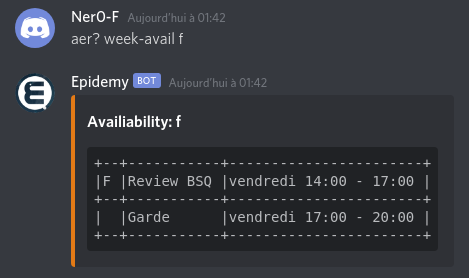
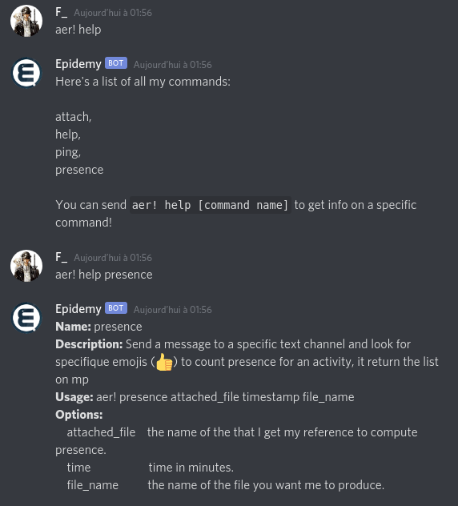
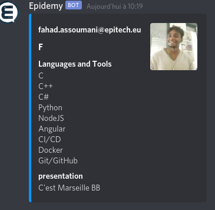

<p align="center">
  <a>
    
    
  </a>
  <p align="center">A Discord bot to see your favorites AERs disponibilities and more</p>
  <p align="center">
    <a href="/doc/coc.txt">
        
    </a>
    <a href="https://codecov.io/gh/Nero-F/Epidemy">
        
    </a>
    <a href="https://github.com/Nero-F/Epidemy/actions/workflows/epidemy_ci-cd.yml">
        
    </a>
  </p>
</p>

# Epidemy
Your friendly Epimote bot

## Description

This bot is used to provides AERs informations to the students, such as their organizations or what skills they have.
It is also usefull for the AERs to check students presence on pedagogical activites when their are organize on Discord.

##### The name is a reference of the recents COVID events that led France to be confined and thus forced us to give pedagogical activities in full remote and also because the school is Epitech ;) 

## Features

### Done
- [x] Get global informations about an AER
- [x] Display AERs schedule of the week 
- [x] List all AER of Bordeaux
- [x] System to check students presence on activities

### Planned

- [ ] Automatically update presence directly on the intranet
- [ ] Ping on-guard AER instead of the common role
- [ ] Search for a skill and get a list of praticants
- [ ] Make a full wiki
- [ ] Delete remaining file once presence done

## Config File

### Dotenv

A .env.example is provided, just fill in the blank.
Here are the principles variables you need to get, I've already given most of them.

| VARENV | VALUE |
|--------|-------|
| APP_ID & APP_SECRET | Ask me I'll give you or go on azure epitech portal and create a brand application |
| BOT_TOKEN | The token of your application (go to the discord dev portal) |
| BOT_TOKEN_DEV | The token of your application in development  |
| ID_AER_CALENDAR | The ID of the calendar in which we retreive informations |
| INTRA_AUTOLOGIN | The autologin link/token of an pedagogical member |
| DISCORD_PREFIX | prefix that will trigger bot command| 
| DISCORD_PREFIX_ADMIN | prefix that will trigger admin bot command| 

:exclamation: some are not actually implemented so don't worry and leave them blank, only the variables above are mandatory.

### AER

If you come from another Epitech's campuses than Bordeaux, modify this file as you please. It contains all informations about the AERs. I provide an example with my own infos.

## Dependencies

Make sure _redis-server_ is installed.

## Installation

You have the choice of using Docker to run the app with 

```$ docker-compose up -d ```

or run it locally with

```$ npm install && npm start ```

## Some screenshots of actual features





## Disclaimer

This bot still under development, I only code it for fun, to practice a little bit of Node and to help my comrades at school.